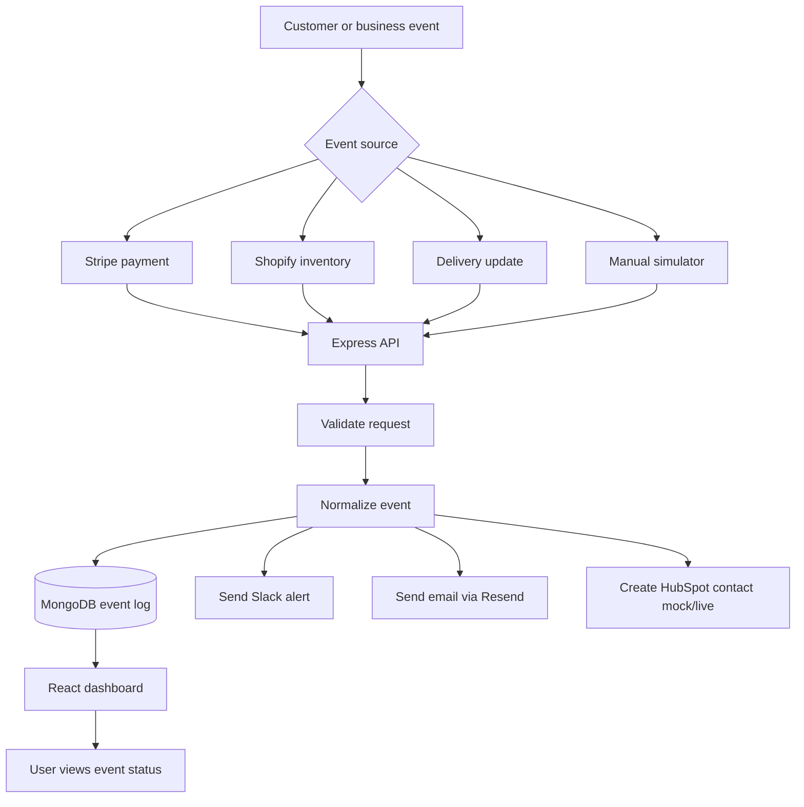

# Simple App Flow

## Plain-English Version

1. A payment, inventory, delivery, or test event happens.
2. The backend receives and validates the event.
3. The app saves a normalized event record in MongoDB.
4. The app sends alerts to Slack, email, and optionally HubSpot.
5. The dashboard shows the latest event status for the user.
